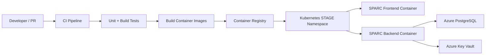

# SPARC STAGE Environment Plan

This document captures the DevOps direction for the SPARC STAGE environment.

## DevOps Direction Received

- Keep the application fully containerized.
- Run SPARC on the Kubernetes cluster like the other apps.
- Use Azure PostgreSQL for the database.
- Pull secrets from Key Vault.
- Key Vault access can happen in the app itself, or secrets can be injected as environment variables at startup.
- Preferred secret pattern: app-owned Key Vault retrieval where practical.
- CI/CD should build the container image and run unit tests.

## Target STAGE Architecture

## Container Strategy

SPARC currently has separate frontend and backend containers for local development.

For STAGE, decide between two deployment shapes:

1. **Two-container deployment**
   - Frontend container serves the React app.
   - Backend container serves FastAPI.
   - Kubernetes routes `/api` to backend and web traffic to frontend.

2. **Single app image**
   - Build frontend static assets.
   - Serve frontend and FastAPI from one container or one pod.
   - Simpler routing, but less separation.

**Recommended default**: keep frontend and backend as separate images for now. It matches the current scaffold and keeps API/runtime concerns cleaner.

## STAGE Configuration

Expected STAGE configuration values:

- `DATABASE_URL`
- `FRONTEND_ORIGIN`
- `JIRA_API_EMAIL`
- `JIRA_API_TOKEN`
- Jira/Rovo site or scope configuration once live integration begins
- Key Vault name or URI if the app retrieves secrets directly
- Any managed identity/client identity settings required by the platform

## Secret Management Options

### Option A: Inject Secrets At Startup

Kubernetes or the platform pulls Key Vault secrets and injects them as environment variables.

**Pros**

- Simple application code.
- Works with the current FastAPI settings pattern.
- Easier first STAGE deployment.

**Cons**

- Secret rotation depends on deployment/runtime refresh behavior.
- The app does not directly know where secrets came from.

### Option B: App Retrieves Secrets From Key Vault

SPARC backend retrieves required secrets from Key Vault at startup or through a secret provider abstraction.

**Pros**

- Matches DevOps preferred pattern.
- Keeps secret ownership explicit in app startup.
- Can support controlled refresh behavior later.

**Cons**

- Requires Azure identity setup in Kubernetes.
- Adds cloud-specific code path.
- Needs local fallback for development.

**Recommended path**

Start with a configuration abstraction that supports both:

- local and simple STAGE mode: environment variables
- preferred STAGE mode: Key Vault provider

This avoids blocking the app while DevOps finishes identity and Key Vault plumbing.

## Backend Changes Needed

- Add production-safe settings validation.
- Add a secret provider abstraction:
  - environment provider
  - Key Vault provider later
- Add database migration command for deployment startup.
- Add health endpoints:
  - liveness
  - readiness
  - database connectivity
- Add structured logs for startup, sync runs, import runs, and failures.
- Ensure CORS and frontend origin are environment-specific.
- Ensure Jira/Rovo credentials are never returned in API responses.

## Frontend Changes Needed

- Build static assets during CI.
- Externalize API base URL per environment.
- Avoid baking STAGE-only secrets or sensitive configuration into frontend assets.
- Add a small visible environment marker only if stakeholders want it, such as `STAGE`.

## Database Plan

- Use Azure PostgreSQL for STAGE.
- Use Alembic migrations for schema changes.
- CI/CD or release process should run migrations before or during deployment.
- Seed scripts should support non-production seed/reference data without overwriting real pilot data.
- Application startup should not blindly reseed mutable business data in STAGE.

## CI/CD Pipeline Expectations

Minimum CI jobs:

- Backend tests.
- Frontend typecheck and build.
- Docker image build.
- Container image publish to registry.
- Optional vulnerability/dependency scan if the existing platform expects it.

Minimum CD jobs:

- Deploy backend image to STAGE Kubernetes namespace.
- Deploy frontend image to STAGE Kubernetes namespace.
- Run migrations against Azure PostgreSQL.
- Verify readiness endpoint.
- Smoke test Dashboard/API route after deployment.

## Kubernetes Deliverables

Coordinate with DevOps on whether manifests live in this repo or the platform repo.

Expected Kubernetes resources:

- Namespace or namespace reference for STAGE.
- Deployment for backend.
- Deployment for frontend.
- Service for backend.
- Service for frontend.
- Ingress or route.
- Secret or external secret configuration.
- ConfigMap for non-sensitive settings.
- Readiness and liveness probes.
- Resource requests and limits.

## Acceptance Criteria For First STAGE Deployment

- CI builds passing frontend and backend checks.
- Container images are built and published.
- Kubernetes deployment can pull the images.
- Backend connects to Azure PostgreSQL.
- Backend reads required secrets through the agreed Key Vault pattern.
- Migrations run successfully.
- Frontend loads in STAGE.
- Frontend can call backend `/api` endpoints.
- Health/readiness endpoints pass.
- No Jira/Rovo credentials are present in frontend code, logs, or API payloads.

## Open Questions For DevOps

- Which container registry should SPARC publish to?
- Should Kubernetes manifests live in this repo or a separate deployment repo?
- What is the STAGE namespace name?
- What host name or ingress path should STAGE use?
- Is the cluster already configured for Key Vault integration?
- Is managed identity available to the pod, or should secrets be injected at startup?
- Should migrations run as a CI/CD job, init container, or manual release step?
- Are frontend and backend expected to be separate deployments or one combined app deployment?
- What resource request/limit defaults should SPARC use?
- What log aggregation system should structured logs target?

## Recommended Next Engineering Step

Add STAGE readiness into Milestone 1 and Milestone 11:

- Milestone 1 should add migrations, seed/reset commands, settings validation, and health endpoints.
- Milestone 10 should add CI jobs for tests and container builds.
- Milestone 11 should add Kubernetes/STAGE deployment manifests or handoff artifacts.
